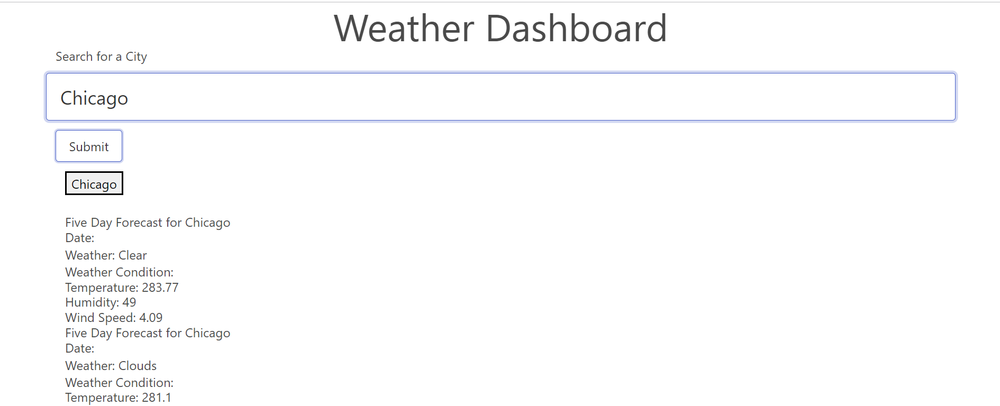

# Assignment: 06 Weather Dashboard

## Description

The application is a weather dashboard. It takes the input of any city and when submitted, reaches out to the weather API to get the five day forecast for that city. The application is programmed to provide the weather, the temperature, the humidity, and the wind speed. When a city is searched, a button is created so that the user can go back in history and recheck that search with the current data.

## Screenshot

## Links

GitHub Repository: https://github.com/1-those-jacks/weather-dashboard
GitHub Page: https://1-those-jacks.github.io/weather-dashboard/
